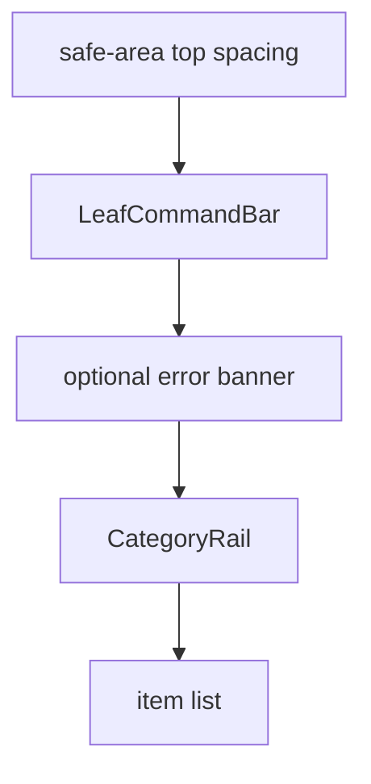

# v2 Command Bar First Layout

## Analysis Checkpoint

The v2 checklist screen was starting with a header, navigation buttons, an item title, loading text, and a reorder toggle before the primary input. That made the screen feel more like a dashboard than a quick checklist surface.

The current v2 direction is more focused: the first visible interaction should be adding or searching for an item.

## Design Checkpoint

`LeafCommandBar` is now the first major surface in the v2 checklist screen.

## Selected Decisions

- Remove the v2 title/subtitle header from the checklist surface.
- Remove Back Home and Refresh buttons from the visible v2 surface for now.
- Remove the item section title above the command bar.
- Move the error banner below the command bar so normal usage still begins with the input.
- Keep category rail and item list below the command bar.
- Keep reorder behavior in the component model, but remove the temporary top reorder toggle from the main screen.

## Sorting / Reorder Follow-Up

Sorting and reorder still need a dedicated v2 decision. The next design pass should decide whether reorder belongs in:

- a category/list management sheet,
- a compact tool near the category rail,
- item drawer actions only,
- or a future list settings surface.

The main rule is that sorting controls should not push the command bar down or make the first screen feel like a settings panel.

## Verification Target

- `yarn run check`.
- `yarn storybook --smoke-test -p 6008`.
- Manual `/` QA for safe-area spacing, command bar focus, category rail position, and item drawer behavior.
