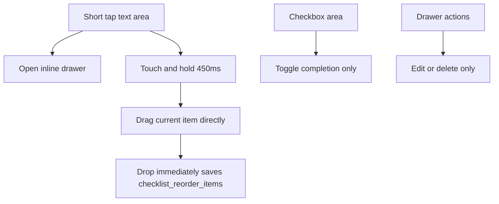

# v2 Item Reorder Direction

## Analysis Checkpoint

v1 reorders items in a modal with drag-and-drop. v2 keeps the user in the current category list instead, because ordering is easiest to understand while looking at the actual list.

Apple gesture guidance treats touch-and-hold and drag as standard direct-manipulation gestures for moving content. `svelte-dnd-action` supports delayed touch drag and drag handles, so v2 can use one surface for normal reading and reordering without adding a separate reorder mode.

## Design Checkpoint

## Selected Decisions

- Long press starts drag directly from the item text area.
- There is no persistent reorder mode, no bottom done bar, and no category manage sheet entry for item sorting.
- Short tap on the text area still opens and closes the drawer.
- Checkbox and drawer action buttons are not drag handles, so they keep their own behavior.
- The command bar and category rail remain visible while reordering.
- Dragging uses a quiet surface: default drop target outlines and morph helper visuals are disabled.
- Pending and completed items are separate reorder zones, so items move only inside their completion group.
- Completion toggles use a parent-controlled move overlay between the pending and completed zones, so checking an item visibly sends it downward before the destination row appears.
- Drop finalizes immediately and saves through the existing v2 reorder command.
- Save failure reloads the current category items and leaves the visible error banner to the v2 store.

## Verification Target

- `yarn run check`.
- `yarn storybook --smoke-test -p 6008`.
- Storybook checks for normal, mixed done/undone, empty list, and long list drag-ready states.
- Manual `/` QA for text long press drag, persistence after restart, ghost click suppression, scroll conflict, and reduced motion.

## References

- Apple Human Interface Guidelines: [Drag and drop](https://developer.apple.com/design/human-interface-guidelines/drag-and-drop)
- Apple iPad User Guide: [Drag and drop on iPad](https://support.apple.com/en-euro/guide/ipad/ipadaa83b207/ipados)
- `svelte-dnd-action`: [`delayTouchStart`, `dragHandleZone`, `dragHandle`](https://github.com/isaacHagoel/svelte-dnd-action)
