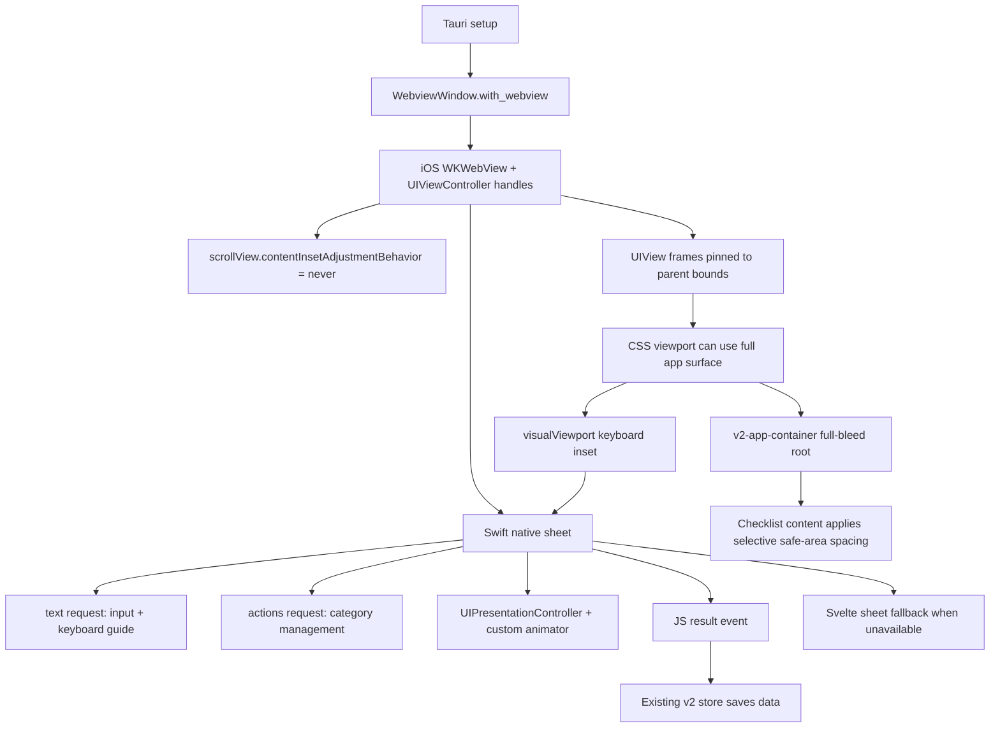

# v2 iOS Bottom Sheet Viewport

## Analysis Checkpoint

The v1 home screenshot showed normal list content reaching the bottom of the iPhone screen. That path is not a bottom sheet: v1 keeps the app shell fixed, scrolls only the list area, and gives the item list large bottom padding so floating actions do not cover content.

The v2 issue is different. Bottom sheets open over the current screen, and iOS WKWebView may expose a CSS viewport that is shorter than the physical screen. On iPhone 16 Pro Simulator, `innerHeight`/`100dvh` measured `778px`, while `outerHeight`/`screen.height` measured `874px`. The visible lower blank area was this `96px` reserved gap, not just the `34px` safe-area inset.

## Selected Decisions

- Keep v2 detail editing and category management as bottom-sheet-style interactions. On iOS Tauri runtime, v2 bottom-sheet surfaces use the Swift native sheet and do not fall back to a web bottom sheet. Storybook, desktop, and browser keep the Svelte fallback components.
- Define shared `--safe-area-*` variables in global CSS so v2 components do not reference missing custom properties.
- Keep the existing `.app-container` safe-area behavior for v1, but let v2 opt into a `v2-app-container` full-bleed root.
- In v2, let the background and overlays fill the viewport, then protect only the checklist content edge spacing with `max(default spacing, safe-area inset)`.
- Blur the currently focused editable element when `BottomSheet` opens.
- Keep the sheet on `fixed inset-0` with `dvh`-based max height.
- Measure both the visual viewport bottom gap and the iOS `outerHeight - innerHeight` reserved bottom gap, then extend the overlay/sheet background into the larger value.
- Treat keyboard overlap separately from the reserved bottom gap. When `visualViewport` shrinks, move the sheet wrapper up by the measured keyboard inset and recalculate the sheet max height from the visible viewport.
- While a v2 bottom sheet is open, set the document root background to the sheet surface color. iOS may paint the reserved area outside fixed descendants, so the root background is the final fallback for that lower strip.
- Do not use `lvh` for the sheet, because it can place sheet content behind the iOS-reserved bottom area.
- Configure the iOS WKWebView from Rust setup through Tauri's `with_webview` hook instead of editing generated Xcode files.
- On iOS, disable the WKWebView scroll view's automatic content inset adjustment and pin the WKWebView/root UIView frames to their parent bounds.
- Use one generic native sheet bridge for `text` and `actions` requests. iOS 15+ uses a custom Swift `UIPresentationController` surface; text requests use custom keyboard-frame placement, while action requests use the same Tickly colors, spacing, and button tone.
- Use a custom Soft Leaf outer sheet for iOS native bottom-sheet surfaces. The presented view has a transparent root and an ink outer shape with an inset white fill using the Tickly Soft Leaf radius pattern: top-left `6`, top-right `24`, bottom-right `6`, bottom-left `24`.
- Match the Svelte `BottomSheet` fallback to the same Soft Leaf radius pattern. Storybook, desktop, browser, and native-unavailable fallback now show the same bottom-sheet silhouette as the Swift sheet.
- Use the same Soft Leaf language for v2 web Leaf surfaces. Standard v2 Leaf components use `6px/24px`, while compact Leaf surfaces use the same proportion, such as `5px/18px`.
- Keep this custom presentation intentionally stable-first: backdrop tap, cancel/save/action results, keyboard movement, and a simple downward drag-dismiss are supported; full system detent parity is not part of this step.
- Emit native sheet results only after a programmatic dismissal completes. This lets category manage actions chain into category rename text sheets without racing the still-dismissing action sheet.
- Keep `ConfirmModal` in Svelte because it is a centered destructive confirmation modal, not a bottom sheet.
- Swift source is stored in the iOS template and copied into `src-tauri/gen/apple/Sources/tickly/` so generated Xcode files are not the only source of truth.
- After adding or changing app-level Swift sources, regenerate the generated iOS Xcode project with `src-tauri/scripts/setup-ios-widget.sh` or `xcodegen generate`; a copied Swift file is not active until `tickly.xcodeproj` includes it in the target sources.
- Native sheet result handling is intentionally narrow: Swift returns `saved`, `action`, or `cancelled` through a JavaScript event, and Svelte continues to call the existing v2 mutation handlers. Native code does not write SQLite data.

## Native Sheet Integration Status

- The first simulator build copied the old text-sheet Swift source but did not include it in the generated Xcode target, so runtime fell back to the Svelte sheet.
- Regenerating `src-tauri/gen/apple/tickly.xcodeproj` with `xcodegen generate` is required after app-level Swift source changes.
- The current native bridge is `TicklyNativeSheet.swift` with the exported `_tickly_show_native_sheet` symbol.
- Native text requests cover item text edit, category create, and category rename.
- Native action requests cover category management actions: rename, edit order, and delete request.
- In the iOS app runtime, native sheet unavailability cancels the sheet request instead of opening the web fallback. This keeps bottom-sheet surfaces consistently native during simulator/device QA.
- Confirm modal, drawer, search, item reorder, and category rail remain web UI.

## Boundary Diagram

## External References

- [WebKit's iPhone X guidance](https://webkit.org/blog/7929/designing-websites-for-iphone-x/) describes `viewport-fit=cover` as the web-side switch for using the whole screen, followed by selective `env(safe-area-inset-*)` padding for important content.
- [Tauri `WebviewWindow::with_webview`](https://docs.rs/tauri/latest/x86_64-apple-ios/tauri/webview/struct.WebviewWindow.html) is the platform escape hatch used here, and it runs the closure on the main thread.
- [Tauri architecture](https://v2.tauri.app/concept/architecture/) places WRY as the WebView abstraction layer, so native WebView adjustment belongs behind a small platform-specific helper.
- [Apple `UIPresentationController`](https://developer.apple.com/documentation/uikit/uipresentationcontroller) is the native primitive for the custom Leaf outer sheet.
- [Apple custom presentation guide](https://developer.apple.com/library/archive/featuredarticles/ViewControllerPGforiPhoneOS/DefiningCustomPresentations.html) describes the custom presentation controller approach used for the Leaf sheet surface.
- [Apple `UIKeyboardLayoutGuide`](https://developer.apple.com/documentation/uikit/uikeyboardlayoutguide) is the native keyboard-avoidance primitive used by text requests.
- [Tauri mobile plugin development](https://v2.tauri.app/develop/plugins/develop-mobile/) documents Swift/native integration; this integration keeps the bridge app-local instead of introducing a full plugin package.

## Verification Target

- `yarn run check`.
- `yarn build`.
- `yarn storybook --smoke-test -p 6008`.
- `cd src-tauri && cargo check --target aarch64-apple-ios-sim`.
- `yarn tauri ios build --debug --target aarch64-sim`.
- `nm -gU src-tauri/gen/apple/build/arm64-sim/Tickly.app/Tickly | rg tickly_show_native_sheet`.
- iPhone Simulator QA for command bar focus, native category/item text sheets, native category manage actions, web confirm modal, keyboard open/close, sheet staying above the keyboard, native fallback behavior, and v1 home list bottom rendering.
