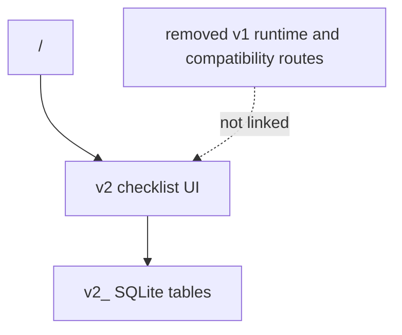

# v2 Main UI Transition

## Analysis Checkpoint

v2 reached a point where the rebuilt local checklist, tags, repeat rules, reminders, archive, streak, graph, settings, and iOS widget flow can be the only app runtime. The follow-up cleanup removed the old v1 runtime/source surface instead of keeping it as a reference path.

## Selected Decisions

- `/` is now the canonical v2 checklist route.
- `/v2` compatibility alias was removed after v2 became the only app surface.
- `/v1` no longer exists as a route.
- Legacy `/graph`, account, and Supabase-era cloud sync settings routes were removed instead of redirected.
- v1 data migration is intentionally skipped because there are no existing users for this rebuild.
- v1 cloud auth/realtime is not started by the main runtime. Current iCloud sync is a separate opt-in checklist sync surface.
- v1 Svelte components, v1 stores/API wrappers, and v1 Rust commands/repositories/services/models are removed from the active source tree.
- New SQLite setup creates only settings and v2 tables. Existing old tables may remain in an existing local database file, but no supported runtime code reads or writes them.
- iOS v2 bottom-sheet surfaces can use the Swift native sheet bridge, but route ownership and data persistence still stay in the v2 Svelte/store layer.

## Boundary Diagram

## Verification Target

- `yarn run check`.
- `yarn build`.
- Manual `/` QA for v2 checklist and iOS native/web sheet behavior.
- Source cleanup verification: no v1 command/store/API route is linked from the runtime command handler or Svelte route shell.
- Route cleanup verification: `/v1`, `/v2`, `/graph`, `/settings/account`, and `/settings/icloud` are not present in the SvelteKit route tree.
