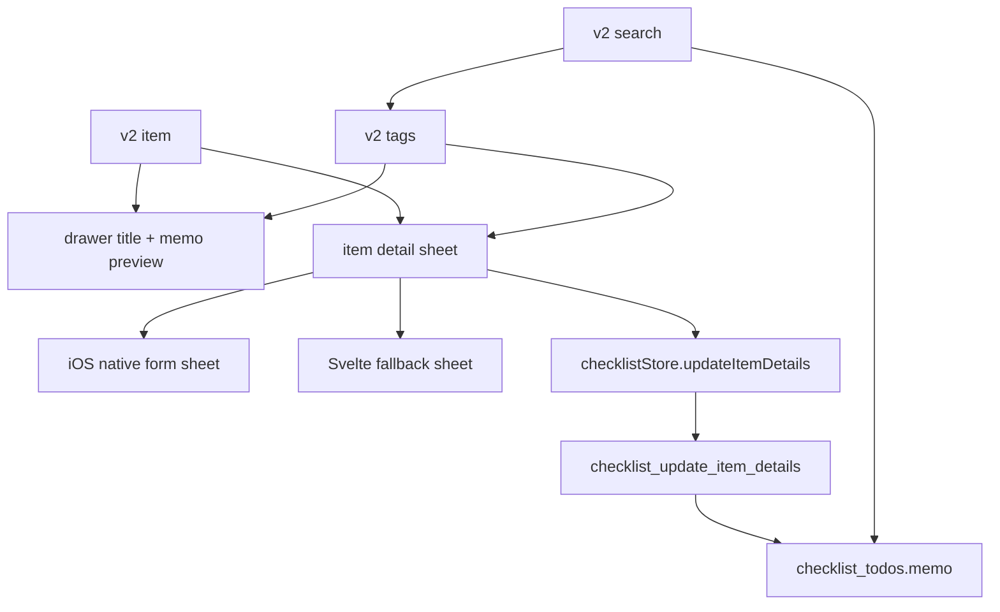

# v2 Item Memo Direction

## Decision

Memo is the first v2 item-detail expansion after the local checklist core.
It stays plain text and belongs only to items.

## Boundaries

- Drawer shows the item title first, then memo as a read-only preview when present.
- Drawer title and memo preview are each capped at 4 lines to keep the list context stable.
- Editing happens in the item detail sheet together with the item name.
- Search matches item name, memo, and tag names. Local repeat and reminder metadata are shown in item detail surfaces but are not part of search; linked apps and sync metadata remain out of scope.
- Empty memo input is stored as `null`.

## Verification Target

- Rust in-memory tests cover memo migration, create default `null`, update details, blank memo normalization, and memo search.
- Storybook covers drawer title + memo preview, item detail memo/tag editing, and memo/tag search suggestions.
