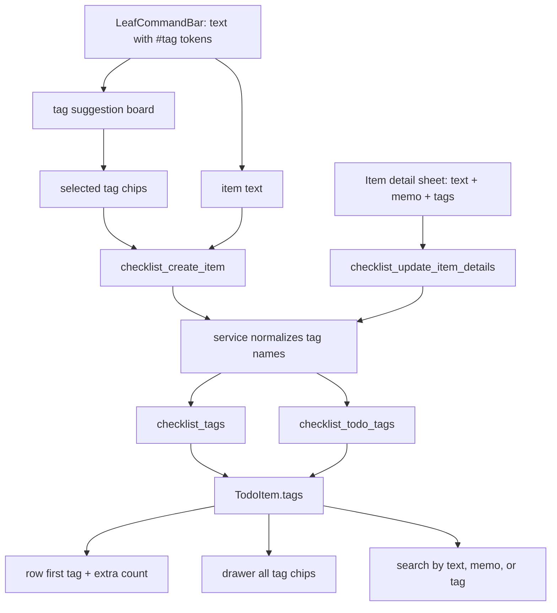

# v2 Item Tags Direction

## Decision

Tags are the first cross-category metadata in v2. Categories remain the primary space an item belongs to, while tags give an item extra searchable context.

This slice covers editing, display, and search only. Tag-only filter screens, tag management, tag colors, sync, widget, and graph behavior stay out of scope.

## Input Rules

- A tag token starts with `#` at the beginning of the input or after whitespace.
- `#` inside a word is not a tag, so text like `C# study` remains normal item text.
- Tag names are short labels without spaces. Allowed characters are Unicode letters/numbers, `_`, and `-`.
- Selecting a suggested tag removes the active `#tag` token from the text input and adds the tag to selected chips below the command bar.
- If there is no exact existing tag for the current token, the suggestion board keeps a `#tag` create row. Selecting that row removes the token and adds it to selected chips.
- Directly submitting text does not auto-convert raw `#tag` tokens into tags. The user confirms tags by selecting an existing suggestion or the create row.
- Duplicate tags are stored once. Leading `#`, surrounding whitespace, and duplicate casing are normalized again in the Rust service layer.
- If removing tag tokens leaves empty item text, the item is not created.

## UI Roles

- Add mode in `LeafCommandBar` separates creation, tags, and search as `+ | input | # | search`.
- The `#` control prepares a tag token at the current caret position and opens the tag suggestion board.
- Add mode also shows the tag suggestion board when the caret is inside an active `#tag` token.
- Suggestions prefer prefix matches, then contains matches, and stay anchored below the command bar without moving the category rail or list.
- Suggested tags selected from the board are shown as removable chips in the same overlay, keeping the item text input focused on the item name.
- Closed rows use the reserved metadata slot for the first tag and a `+N` count.
- Open drawers show all tags under the title and memo preview.
- The item detail sheet owns full tag editing. iOS uses the Swift native form field with tag chips; Storybook, desktop, and browser use the Svelte `TagEditor` fallback.

## Data Boundary

- `checklist_tags` owns unique tag names.
- `checklist_todo_tags` owns item/tag membership.
- Item delete, category delete, and tag replacement clean up unused v2 tags.
- v1 tag tables, stores, and sync flows are not used.

## Verification Target

- Rust in-memory tests cover tag table creation, create with tags, replace tags, unused-tag cleanup, normalization, invalid names, and search by tag.
- Storybook covers command-bar tag suggestions, row tag metadata, drawer tag preview, detail-sheet tag editing, and search tag matches.
- iOS simulator QA should verify native tag chip add/remove/suggestion/save inside the custom Swift Leaf sheet.
