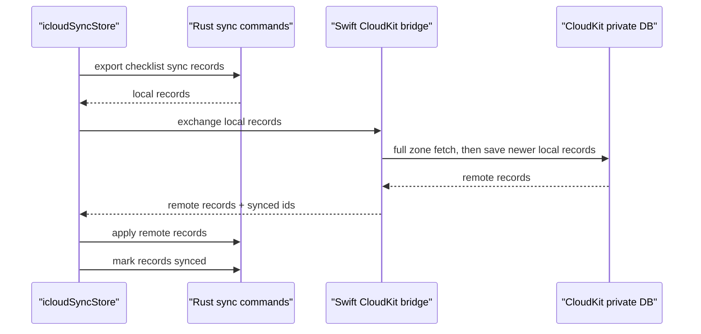

# 019. iCloud Sync Pilot

## Summary

iCloud sync is reintroduced as an opt-in iPhone/iPad sync surface for devices using the same Apple ID.

The current implementation is a foreground CloudKit pilot: sync runs when the app starts, returns to foreground, the user taps Sync Now, local checklist mutations schedule a short debounce sync, and the visible main screen keeps a low-frequency one-shot pull timer for changes made on another device. The pilot favors correctness over minimal traffic by exporting local records and fetching the whole CloudKit zone during foreground exchanges. Background push and full automatic sync are deferred.

This note uses `019` because `018` is already used by tag management.

## Boundary

- iOS app support remains iOS 15.0, but iCloud sync is available only on iOS 17+.
- The feature is off by default and must be enabled from `/settings/icloud`.
- Sync is same-Apple-ID personal device sync only. CloudKit Sharing/collaboration is out of scope.
- Sync covers checklist categories, todos, tags, todo-tag relationships, completion logs, and `reset_time`.
- Theme, font, and language remain per-device settings.
- Supabase-era auth/sync/account flows remain removed and are not part of this design.

## Data Contract

Current checklist rows do not get sync columns directly. Sync state lives in:

- `checklist_sync_metadata`: entity type, local id, CloudKit-safe sync id, sync status, tombstone time, last synced time, and last local update time.
- `checklist_sync_state`: user enablement, last sync time, and last error.

Synced entity types:

- `category`
- `todo`
- `tag`
- `todo_tag`
- `completion_log`
- `setting` for `reset_time`

Deletes are exported as tombstones before local hard deletion is allowed. Relationships use sync IDs rather than local SQLite IDs.

## CloudKit Contract

Swift owns CloudKit communication through the private database and custom zone `TicklyChecklist`.

Record types:

- `TicklyCategory`
- `TicklyTodo`
- `TicklyTag`
- `TicklyTodoTag`
- `TicklyCompletionLog`
- `TicklySetting`

Rust owns SQLite export/import, local merge application, tombstones, and metadata updates. The frontend sync store coordinates the foreground exchange:

## Merge Rules

- Categories, todos, tags, relationships, and settings use record-level latest `updated_at` wins.
- Completion logs merge by item/date. If both sides wrote the same day, the larger `completed_count` is preserved.
- Archived, repeat, reminder, and streak fields are included in the todo payload.
- Same-name category or tag records can attach to the existing local row during remote apply to avoid duplicate first-sync surfaces where practical.

## Runtime Policy

- Sync off stops future sync only. It does not delete local data or CloudKit data.
- If iCloud account status, CloudKit, or OS support is unavailable, settings show an unavailable/error state and the app remains local-only.
- Local checklist mutations schedule a short debounce sync after persistence succeeds.
- While the main screen is visible, a single low-frequency foreground pull timer keeps iPhone/iPad peers from requiring a manual foreground bounce just to see changes made on another open device.
- Foreground exchanges currently use full-zone fetch/export rather than a persisted CloudKit change token. This avoids dropping records when a first-sync category mapping or dependency record is not applied on the first pass.
- Foreground resume runs repeat processing, sync, notification/widget refresh, and current screen reload in the route shell.

## Verification Target

- Rust tests for sync metadata, baseline sync IDs, tombstones, remote apply, conflict handling, todo-tag relationships, completion log count merge, and `reset_time`.
- Frontend checks for settings states and debounce scheduling through `icloudSyncStore`.
- iOS build after syncing repo-owned Swift sources with `src-tauri/scripts/setup-ios-widget.sh`.
- Real-device QA is still needed for same-Apple-ID iPhone/iPad sync because simulator account availability depends on the local simulator state.
