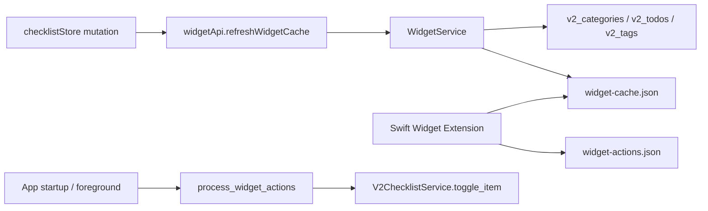

# 020 - v2 Widget Direction

## Decision

The iOS widget now reads v2 data while keeping the existing Widget Extension contract. Swift still reads `widget-cache.json` and queues `widget-actions.json`; Rust now fills and processes those files from the v2 checklist model.

## Data Flow

## Boundaries

- The JSON cache shape and file names stay stable so the Widget Extension can keep its existing loader, configuration intent, and optimistic action queue.
- Snapshot generation uses only active v2 items: `archived_at IS NULL`.
- Widget categories are v2 categories. Empty categories remain visible to widget configuration.
- Pending widget rows use v2 tags for the compact `#tag +N` display.
- Widget check actions toggle v2 items and use v2 repeat/completion-log behavior.
- v1 stores, v1 todo tables, and v1 repeat/widget flows are not used for the v2 widget.

## UI

The Widget Extension keeps the current home and lock screen widget structure, with light v2 polish: localized short copy, Soft Leaf checkbox/row surfaces, Tickly ink strokes, and v2 theme colors from the snapshot.

## Verification

- Rust tests cover snapshot generation from v2 category/item/tag data, archived-item exclusion, empty-category summaries, duplicate queued action suppression, and ignoring archived queued actions.
- Frontend validation uses `yarn run check` and `yarn build`.
- iOS validation requires `src-tauri/scripts/setup-ios-widget.sh`, an iOS simulator build, and manual home/lock screen widget checks.
