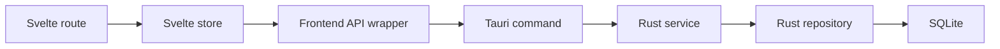
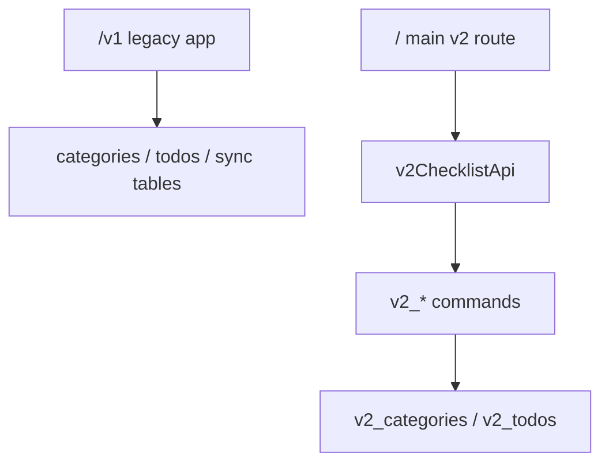
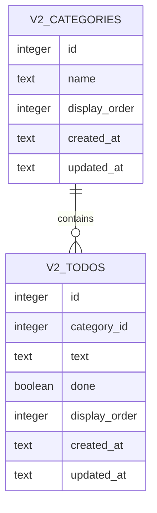

# v2 Local Checklist Boundary

## Analysis Checkpoint

Tickly v1 already has a layered architecture:

The v1 checklist is connected to repeat rules, tags, streaks, widgets, notifications, and sync. v2 starts by isolating the local checklist core so that it can be understood and verified without those feature branches.

## Design Checkpoint

v2 uses parallel names and tables:

This keeps the existing app available as legacy while the local checklist model becomes the main UI.

## Data Model

## Excluded From First Slice

Search, tags, repeat rules, streaks, reminders, linked apps, graph view, widgets, Supabase sync, and data migration are intentionally excluded.

## Verification Target

- Rust in-memory SQLite tests for v2 repository/service behavior.
- `yarn run check` for Svelte and TypeScript.
- Storybook states for v2 screen variants.
- Manual `/` QA for CRUD, completion, ordering, and persistence.

## Implementation Checkpoint

The first v2 slice now adds:

- v2 local SQLite tables through app startup migration.
- v2 Rust model, repository, service, and command layers.
- v2 frontend API wrapper, independent store, main `/` route, compatibility `/v2` alias, and a reusable v2 screen component.
- Storybook coverage for empty, normal, completed, multiple-category, and reorder-mode screen states.
- Directory-level `AGENTS.md` rules and project development principles.

## Verification Checkpoint

- `yarn run check`: passed with 0 errors and 0 warnings.
- `cd src-tauri && cargo test`: passed, including v2 repository and service tests.
- `yarn build`: passed and emitted the v2 route bundle.
- `rustfmt --check` on the new v2 Rust files: passed.

Note: `yarn check` without `run` currently invokes Yarn v1's built-in `check` command in this workspace, so use `yarn run check` for the project script.
