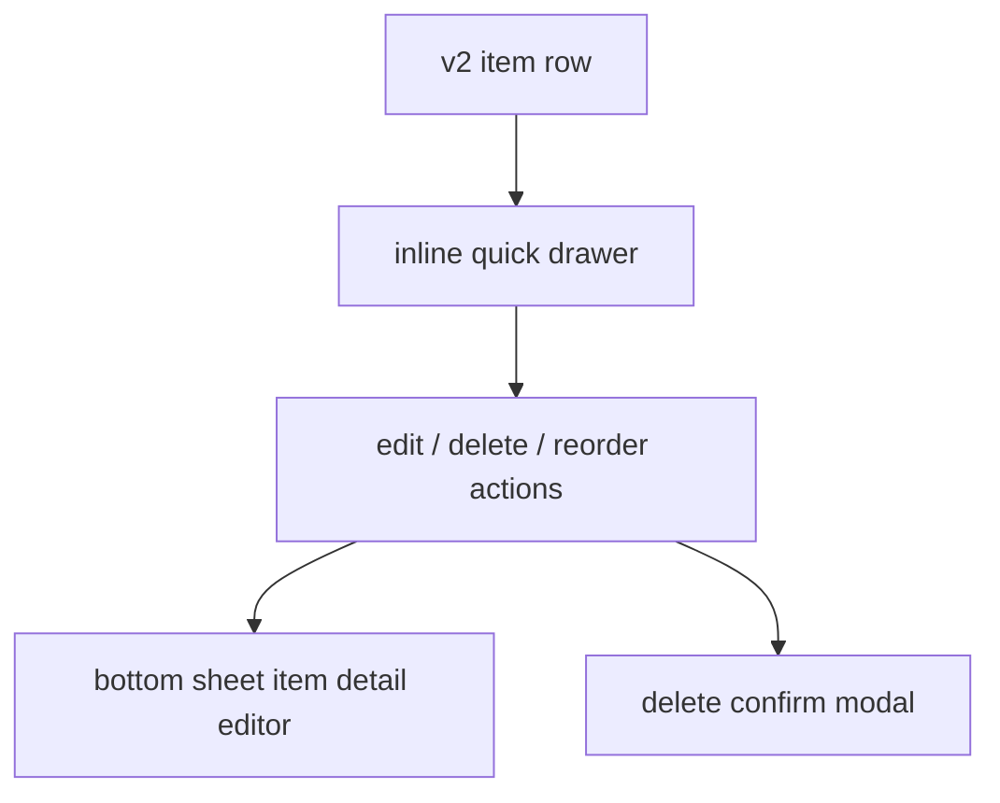

# v2 Item Detail Sheet Direction

## Analysis Checkpoint

v1 uses an inline drawer as a detail surface. `LeafTodoItem` owns the drawer open state, while `HomeTodoList` injects `MemoDrawer` content. That drawer is closer to a quick detail preview than a full editing form.

## Design Checkpoint

v2 keeps the item drawer small and action-focused, then uses a bottom sheet for item editing. This matches the intended iPhone/iPad interaction model: quick row actions stay near the item, while full item settings slide up from the bottom.

## Selected Decisions

- Drawer trigger: tapping the text row toggles the inline drawer. The checkbox keeps its own complete/restore action.
- Drawer role: quick actions now, future lightweight detail preview later. Direct edit inputs do not live inside the drawer.
- Edit role: the Edit action opens the bottom sheet. The bottom sheet is the long-term surface for item settings and editing.
- Delete role: the Delete action opens the confirm modal without forcing the drawer closed, so canceling returns to the same row context.
- Reorder role: Move Up and Move Down appear inside the drawer only while reorder mode is active.
- Motion: the drawer slides first, then its bordered content fades in after a short pause. Closing reverses that order so the content fades out before the drawer collapses.
- Density: v2 uses the `Balanced 44` rule. Primary touch targets stay at least 44px, item text is 16px, item padding is 8px, and the command bar remains visually larger than item rows.

## Surface Boundary

- Drawer: quick item actions and future memo/detail preview.
- Bottom sheet: item settings and editing.
- Confirm modal: destructive confirmation.

The first bottom sheet edits only the item name because `v2_todos` does not yet include memo, tags, repeat rules, reminders, or app links. Those fields should be added to the same sheet when the v2 data model expands.

## Out Of Scope

- No v2 schema change.
- No memo field yet.
- No Tauri command, repository, or store change.
- No v1 drawer, modal, or item component change.

## Verification Checkpoint

- `yarn run check`: passed with 0 errors and 0 warnings.
- `yarn storybook --smoke-test -p 6008`: passed.
- Manual `/v2` QA remains the next checkpoint, especially iPhone/iPad width behavior and the eventual simulator pass.
