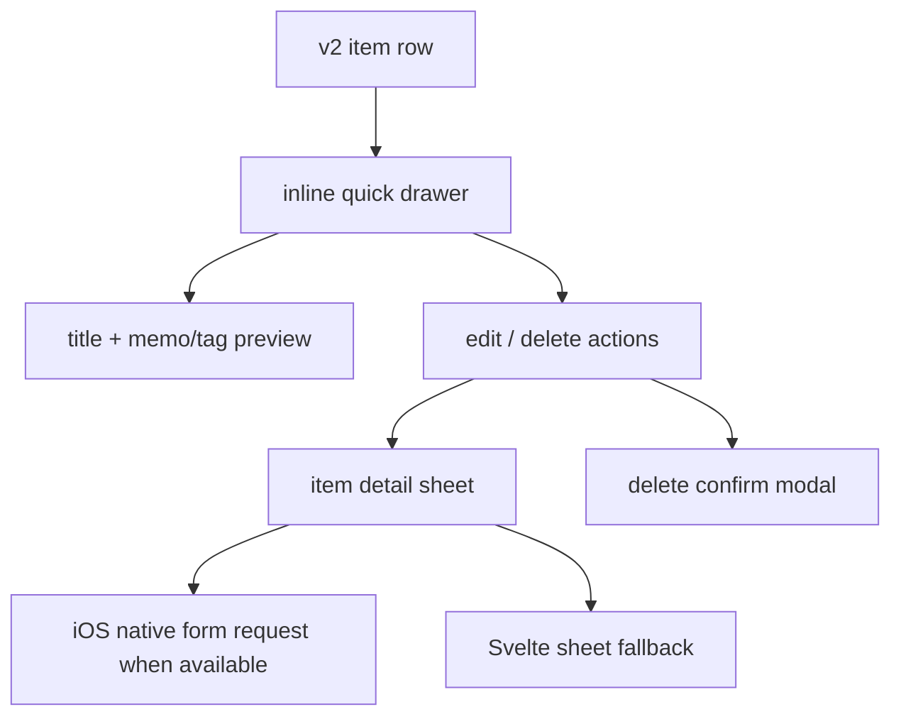

# v2 Item Detail Sheet Direction

## Analysis Checkpoint

v1 uses an inline drawer as a detail surface. `LeafTodoItem` owns the drawer open state, while `HomeTodoList` injects `MemoDrawer` content. That drawer is closer to a quick detail preview than a full editing form.

## Design Checkpoint

v2 keeps the item drawer small and action-focused, then uses a bottom-sheet-style surface for item editing. This matches the intended iPhone/iPad interaction model: quick row actions stay near the item, while full item settings slide up from the bottom.

## Selected Decisions

- Drawer trigger: tapping the text row toggles the inline drawer. The checkbox keeps its own complete/restore action.
- Drawer role: quick actions plus lightweight reading detail. The opened drawer shows the item title first, then memo and tag previews when present. Direct edit inputs do not live inside the drawer.
- Edit role: the Edit action opens the item detail sheet. On iOS app runtime this uses the generic Swift native sheet with a `form` request, including text, memo, tag, and repeat fields. Storybook, desktop, and browser keep using the Svelte `V2ItemDetailSheet` fallback.
- Form style: item detail editing is placeholder-first. Visible field labels are hidden, while accessibility labels remain attached to the name, memo, and tag fields.
- Delete role: the Delete action opens the confirm modal without forcing the drawer closed, so canceling returns to the same row context.
- Reorder role: Move Up and Move Down appear inside the drawer only while reorder mode is active.
- Motion: the drawer slides first, then its bordered content fades in after a short pause. Closing reverses that order so the content fades out before the drawer collapses.
- Density: v2 uses the `Balanced 44` rule. Primary touch targets stay at least 44px, item text is 16px, item padding is 8px, and the command bar remains visually larger than item rows.

## Surface Boundary

- Drawer: quick item actions, up to 4 lines of item title, up to 4 lines of memo preview, and tag chips.
- Item detail sheet: item name, memo, and tag editing. Native iOS owns only the temporary input UI; the Svelte screen still receives the result and saves through the existing v2 store/API flow.
- Confirm modal: destructive confirmation.

The first detail expansion added `memo` to `v2_todos`. The next local metadata expansion adds v2 tags to the same editing surface through `v2_tags` and `v2_todo_tags`.

## Out Of Scope

- No rich text, markdown rendering, image attachments, or link previews for memo.
- No tag-only filter screen, tag management screen, reminder, streak, linked app, sync, widget, or graph behavior in this slice. Local repeat editing now lives in the item detail sheet.
- No native rewrite of confirm modal, drawer, search, item reorder, or category rail surfaces.
- No v1 drawer, modal, or item component change.

## Verification Checkpoint

- `yarn run check`: passed with 0 errors and 0 warnings.
- `yarn storybook --smoke-test -p 6008`: passed.
- iOS simulator build now verifies that the Swift native sheet source is included in the generated Xcode target. Manual `/` QA remains the next checkpoint for keyboard behavior and item edit save/cancel.
