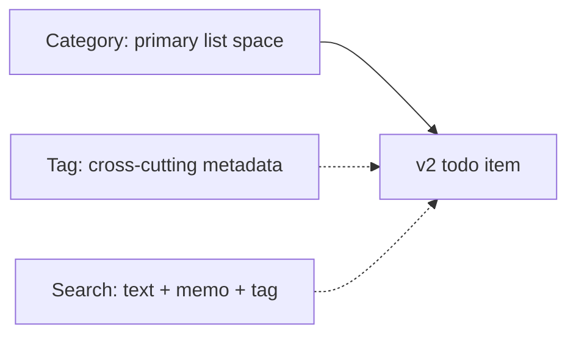
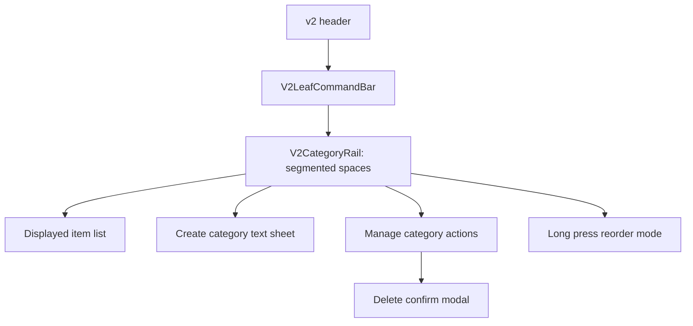

# v2 Category And Tags Direction

## Analysis Checkpoint

The category question is not just naming. It defines the first information architecture for v2:

- A category is the primary list space an item belongs to.
- A tag describes optional contexts across categories.
- Search and filters should narrow a list, not replace the main place where a list lives.

v2 therefore keeps categories instead of collapsing everything into tags. This gives the app a stable spatial model, while tags add cross-cutting metadata for display and search.

## Design Checkpoint

The selected UI treatment is `Segmented Spaces`: a compact segmented control between the v2 leaf command bar and the item list.

## Research Summary

- Apple navigation guidance favors stable top-level navigation for major areas and search/filter controls for narrowing larger collections.
- Apple table guidance fits Tickly's text-heavy checklist: rows should stay easy to scan, and selection should give clear feedback.
- Faceted navigation guidance treats filters as a way to reduce a large set, not as the only primary structure.
- Motion guidance points toward short, purposeful transitions: the selected segment should respond first, and the content should change with smaller, quieter motion.
- Material motion guidance warns against transitions where multiple elements cross paths or compete for focus.
- Apple motion guidance supports fading an element out before moving or changing it when the movement itself does not add meaning.

References:

- https://developer.apple.com/design/human-interface-guidelines/tab-bars
- https://developer.apple.com/design/human-interface-guidelines/sidebars
- https://developer.apple.com/design/human-interface-guidelines/search-fields
- https://developer.apple.com/design/human-interface-guidelines/motion
- https://support.apple.com/111781
- https://m1.material.io/motion/material-motion.html
- https://m1.material.io/motion/duration-easing.html
- https://codershigh.github.io/guidelines/ios/human-interface-guidelines/ui-views/tables/index.html
- https://media.nngroup.com/media/reports/free/Designing_for_Young_Adults_3rd_Edition.pdf

## Selected Decisions

- Naming stays `Category / 카테고리 / カテゴリ`.
- Categories are required primary spaces. Every v2 item belongs to exactly one category.
- Tags are optional cross-cutting metadata on items. They support inline `#tag` entry, item display, detail editing, and search.
- The category rail sits between `V2LeafCommandBar` and the item list, not in a separate framed page section.
- The category rail is outside the item scroll container. Like the command bar, it stays fixed while only the item list scrolls.
- Category buttons are grouped as a segmented control, so they read as space switching rather than independent tag chips.
- The selected segment is rendered by a separate measured indicator, not by putting background/border styles on each selected button.
- Add and manage live inside the same category rail box as a fixed right tool area, separated from the scrollable segments by a thin divider.
- Create and rename use text-entry sheets. On iOS app runtime they use the generic Swift native sheet with a `text` request; Storybook, desktop, and browser keep using the Svelte `V2CategoryDetailSheet` fallback.
- Category management uses the same native sheet bridge with an `actions` request on iOS. The native result is emitted after dismissal completes, then Svelte selects the next flow: rename opens the native text sheet, edit order enters category reorder mode, and delete opens the existing confirm modal.
- Delete uses the v2 confirm modal because it also deletes the category's items.
- Category order uses a deliberate iOS-style reorder mode: long press enters the mode, categories wiggle lightly, and the full segment can be dragged.
- Category deletion stays behind the manage action surface and confirm modal. Reorder mode does not show delete badges because the category rail is already compact.

## Motion Decisions

- Category selection feedback belongs primarily to the segmented indicator.
- The indicator moves with transform-based `translate3d`, a 220ms standard curve, and measured width/height from the selected button.
- The selected category scrolls into view when needed, unless reduced motion is enabled.
- The item list does not slide left/right. That made old and new rows visually overlap and compete with the indicator.
- Item content uses an out-in dissolve: old rows fade out, a small pause creates breathing room, then the new list fades in with only a tiny vertical nudge.
- Old and new rows are never rendered together during a category switch.
- The v2 store updates the selected category and loaded items together, so real main-route usage avoids animating stale items into the new category state.
- During the short list switch, row pointer events are disabled to avoid acting on a disappearing row.
- Reduced motion keeps the same state changes but removes visible slide and smooth movement.
- Reduced motion also removes the category reorder wiggle while preserving full-segment drag.

## Implementation Boundary

- This slice changes only the v2 category surface.
- Category segments select a primary category.
- Category create and rename use text-entry sheets; delete and order actions live in the category manage action surface and confirm modal.
- Category reorder uses the existing v2 reorder command and does not change the SQLite schema.
- Tag-only filter screens, tag management screens, sidebars, and category delete badges stay out of scope.

## Implementation Checkpoint

This slice now adds:

- `V2CategoryRail` as the inline segmented category switcher.
- `V2CategoryDetailSheet` as the web fallback for category create and rename.
- Swift native sheet text requests for iOS category create and rename.
- Swift native sheet action requests for iOS category manage, with `V2CategoryManageSheet` retained for Storybook, desktop, and browser fallback.
- Category delete confirmation through the existing v2 confirm modal style.
- Long-press category reorder with light wiggle, a `Done` control, and full-segment drag.
- Store error propagation so sheets close only after successful mutations.
- Storybook coverage for rail states, category sheets, manage sheet states, and interactive category switching.
- Documentation for category/tag roles, the selected motion model, and the first local tag slice.

## Verification Checkpoint

- `yarn run check`: passed with 0 errors and 0 warnings.
- `yarn storybook --smoke-test -p 6008`: passed.
- `git diff --check`: passed.
- Manual `/` QA remains the next checkpoint for category create, select, rename, delete, move, persistence, and iPhone/iPad width behavior.
