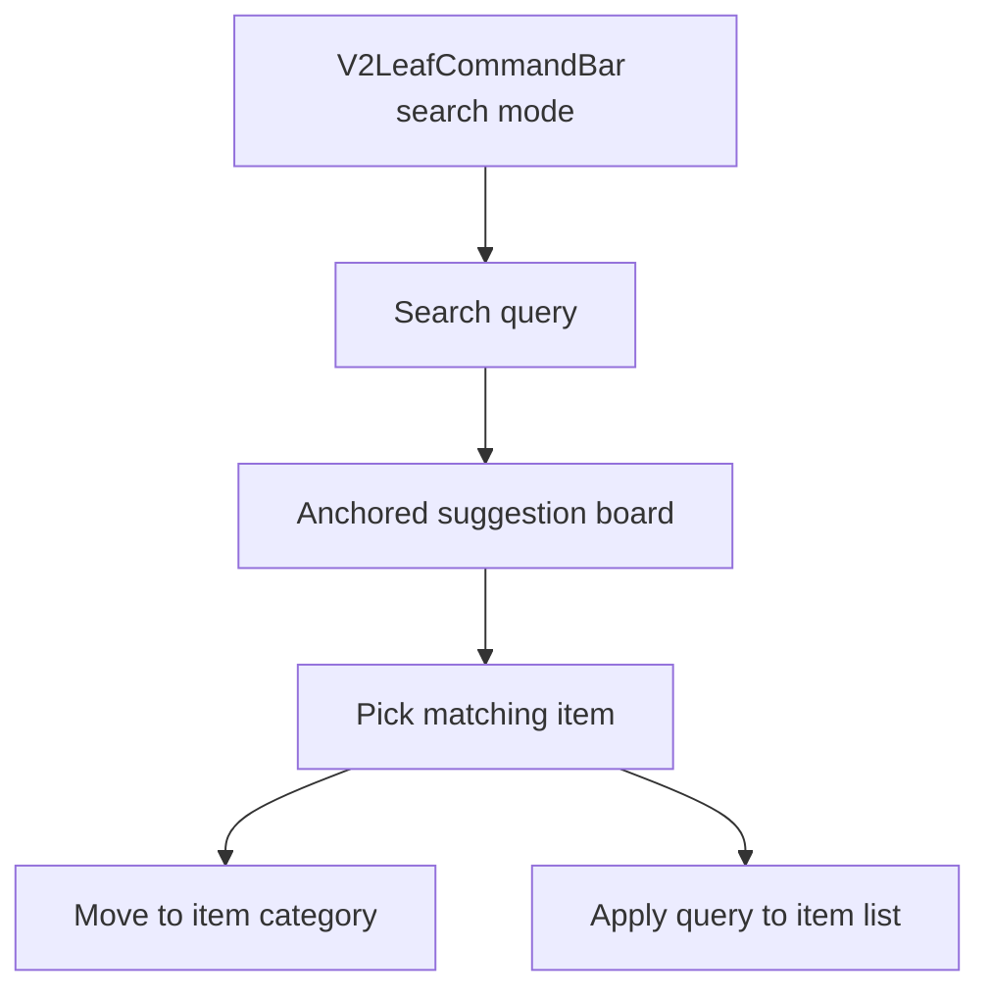

# v2 Search Suggestions Direction

## Analysis Checkpoint

v2 uses categories as the primary spaces for items. Search should help the user find the right item and move to the right space without replacing the category rail or shifting the surrounding layout.

## Design Checkpoint

## Selected Decisions

- In add mode, `V2LeafCommandBar` separates creation, tags, and search as `+ | input | # | search`.
- Search starts from the right search control in add mode, then switches the command bar into search mode.
- Search mode keeps the command bar in place and shows a z-layered suggestion board anchored directly below it.
- The suggestion board visually extends from the command bar but does not push the category rail or item list down.
- Typing a search query updates only the suggestion board; the category rail and item list stay stable.
- Suggestions are global item matches with category names.
- If the query matches only the memo, the suggestion shows a small memo snippet under the item name.
- If the query matches a tag, the suggestion shows a small `#tag` hint under the item name.
- Selecting a suggestion changes to that category, applies the query to the item list, and closes the suggestion board.
- Reorder drag is disabled only after a search query is applied to the visible list.
- v2 search reads `v2_todos.text`, `v2_todos.memo`, and related `v2_tags.name`; repeat rules, linked apps, reminders, and sync stay out of scope.

## Verification Target

- Rust in-memory tests for blank search, category-bearing results, memo/tag matches, ordering, cross-category results, and limits.
- `yarn run check`.
- `yarn storybook --smoke-test -p 6008`.
- Manual `/` QA for search entry, stable underlying list while typing, suggestions, category jump, filtered list after selection, clear, exit, and disabled drag after applied search.
