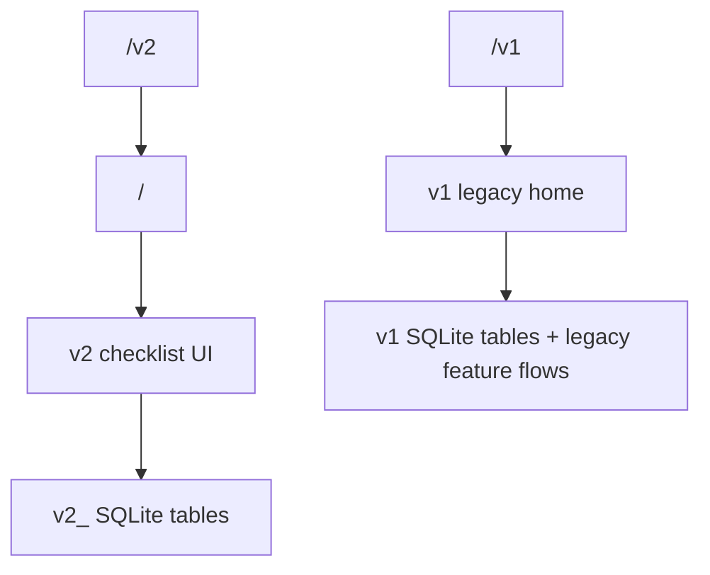

# v2 Main UI Transition

## Analysis Checkpoint

v2 reached a point where the local checklist surface, category rail, item interactions, search suggestions, and iOS sheet behavior are usable enough to become the first screen. v1 still contains important reference behavior and legacy feature flows such as widgets, graph, settings, tags, repeat rules, notifications, and sync.

## Selected Decisions

- `/` is now the canonical v2 checklist route.
- `/v2` remains as a compatibility alias that replace-redirects to `/`.
- `/v1` preserves the pre-v2 home UI and existing v1 data/store flows.
- v1 data and v2 data remain separate. There is no migration in this step.
- v1-specific flows that still operate on `appStore` return to `/v1`, not `/`.
- iOS v2 bottom-sheet surfaces can use the Swift native sheet bridge, but route ownership and data persistence still stay in the v2 Svelte/store layer.

## Boundary Diagram

## Verification Target

- `yarn run check`.
- `yarn build`.
- Manual `/` QA for v2 checklist and iOS native/web sheet behavior.
- Manual `/v1` QA for legacy home access and existing data visibility.
