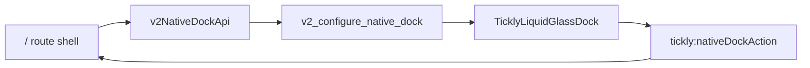

# 011 - Liquid Glass Dock Direction

## Decision

v2 uses a native iOS bottom dock as a small launcher layer above the checklist. It is an iOS-only navigation/control surface that can open the v2 Streak overlay, start current-category archive cleanup, route to existing settings, and emit placeholder feature actions for later slices.

## Structure

## Boundaries

- `Settings` opens the existing settings route with `returnTo=/`, then settings back navigation returns to the v2 main UI.
- `Streak` now opens a v2 web overlay backed by opt-in v2 item streak tracking.
- `Archive` opens a v2 web confirm modal for current-category cleanup. It archives only completed non-repeating items.
- `Graph` still emits a placeholder event. The real v2 graph remains a later slice.
- `V2ChecklistScreen` does not call native APIs. It only reports when web fallback sheets or confirm modals should hide the dock.
- The dock hides while the iOS keyboard is visible, and the root shell hides it while native sheets are open.

## Visual Direction

The native dock follows Liquid Glass as a floating functional layer over content. The first implementation used a custom `UIGlassEffect` tray with circular `UIButton.Configuration.glass()` icon buttons, but that still read too much like a white custom control over Tickly's pale canvas.

The second implementation tried a compact system `UIToolbar` dock. It proved that UIKit could own the buttons, but it read as two floating buttons rather than a clear bottom Dock.

The third implementation tried a full-width bottom system `UIToolbar` dock. It made the Dock easier to notice, but in Tickly's pale checklist surface it still did not show enough Liquid Glass character.

The current direction is an iOS 26+ SwiftUI dock hosted from UIKit with `GlassEffectContainer`, `glassEffect`, and icon-only plain `Button`s. Experiments showed an important constraint: real `.clear` glass still reads as a pale white surface over Tickly's mostly empty, light canvas because there is little visual detail behind it to refract. Weak tint, smoky underlay, and blend experiments did not meaningfully reduce that white read without making the control feel custom.

The `Glass.identity` comparison proved the lower bound: it made the Dock nearly transparent, but it also removed most of the perceivable Liquid Glass body. That experiment is not the product direction.

The current direction uses `Glass.clear.interactive()` with only a very weak ink underlay for contrast. The important visual rule is that Liquid Glass should not be simulated by painting a stronger custom background. Instead, checklist content should be allowed to move behind the native Dock so the glass has real detail to refract. The v2 list therefore keeps enough scroll clearance for the final item, but the bottom fade no longer paints the Dock area with opaque canvas.

Additional backdrop content is intentionally deferred. While the Dock may still read pale over sparse content, the current polish keeps the native glass body and adds only Tickly-shaped cues: a weak ink outline, soft ink shadow, and split-group spacing. This makes the Dock feel intentional without turning it into a custom painted panel.

The Dock sits slightly lower than the safe-area baseline so it belongs to the bottom system layer rather than floating in the middle of the checklist. Its icon targets use a 44pt base, and the feature pill and settings circle keep a generous gap so the 3+1 grouping reads as two related but distinct glass surfaces.

When the native Dock is visible, the web list does not reserve a separate bottom safe-area band and does not render the old bottom fade. The native Dock itself owns the bottom layer; the checklist only keeps scroll clearance so the final item can move above the Dock.

The Dock is split into two glass surfaces. The left surface is a single elongated pill for the feature group: `Streak`, `Graph`, and `Archive`. `Streak` opens the v2 streak overlay. `Archive` asks before hiding the current category's completed regular items. `Graph` remains an intentionally plain placeholder action inside the shared glass surface so the group reads as one control cluster. The right surface is a separate circular glass button for `Settings`. This follows the toolbar grouping principle that related controls should be grouped together while distinct behavior gets its own section.

The `Graph` action uses a compact connected-node glyph rather than a line chart. It reads more like a future relationship/history surface and keeps the Dock icon language simple at small sizes.

Older supported iOS versions keep the UIKit translucent toolbar blur fallback. If SwiftUI glass still does not produce enough native character, the next comparison should be a `UITabBarController` / `bottomAccessory` prototype rather than adding more white custom chrome.
