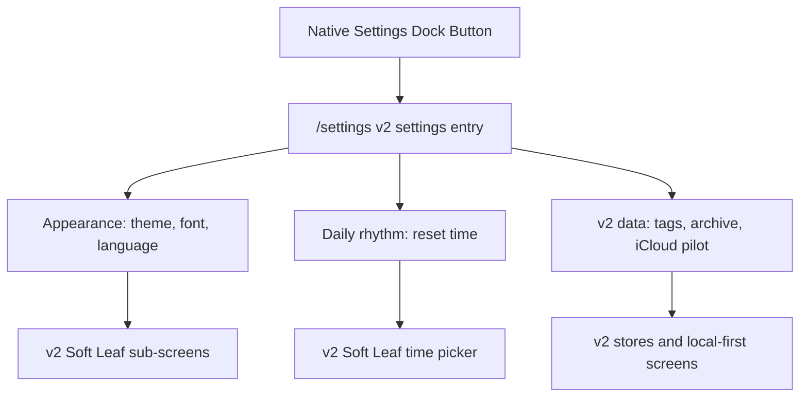

# 012 - v2 Settings Redesign Direction

## Summary

The v2 settings entry screen uses its own v2 shell while preserving the existing settings sub-routes. This keeps the main app flow visually aligned with v2 without forcing a broad rewrite of theme, font, language, or remaining legacy screens.

## Decision

- `/settings` is the v2 settings entry screen.
- Settings groups use a Soft Leaf surface, matching the v2 checklist language while staying quiet enough for repeated utility use.
- Frequently used app-wide preferences are grouped first: appearance, font, language, and reset time.
- v1-era cloud sync remains available only through legacy `/v1` flows and is not linked from the v2 settings entry.
- Appearance sub-routes (`theme`, `font`, `language`) now share the v2 settings shell and Soft Leaf choice surfaces.
- Reset time also uses the v2 settings shell, but keeps the existing `reset_time` setting contract so repeat logic reads the same daily boundary.
- Remaining legacy sub-routes keep their current implementation and `returnTo` behavior until they are rebuilt in focused slices, but the v2 settings entry should not promote v1 cloud sync.

## Verification

- Confirm `/settings?returnTo=%2F` opens the v2 settings entry and back returns to `/`.
- Confirm `/v1` settings entry still preserves `/v1` return flow.
- Confirm each row routes to the existing sub-route without changing its behavior.
- Confirm theme and font preview selections are temporary until Save, and Back restores the previous setting.
- Confirm language selection still saves immediately and returns to the settings entry.
- Confirm reset time saves the existing `reset_time` setting and returns to the settings entry.
