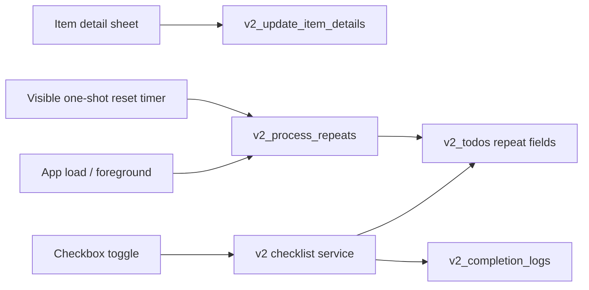

# v2 Repeat Direction

## Decision

v2 repeat starts as local v1 parity: none, daily, weekly by weekday, and monthly by date.
Repeat does not create copied future items. A repeated item stays the same row, records a completion log when checked, and is reactivated when its next due date reaches the current logical date.

## Data Flow

## Boundaries

- `v2_todos` owns `repeat_type`, `repeat_detail`, `next_due_at`, and `last_completed_at`.
- `v2_completion_logs` records local completion counts by logical date for future Archive, Streak, and Graph slices.
- Weekly detail is JSON `[0-6]`; monthly detail is JSON `[1-31]`.
- The logical date uses the existing reset-time setting, but v2 does not read v1 todo/repeat tables.
- While the v2 main screen is visible, a single one-shot timer is scheduled for the next reset time and then rescheduled after it fires.
- Background or suspended execution is not trusted for repeat timing; foreground return still runs `v2_process_repeats` as the correctness fallback.
- iOS uses the Swift native item detail form for repeat editing. Storybook, browser, and native-unavailable contexts use the Svelte fallback sheet.

## Out Of Scope

Notifications, Supabase sync, widgets, Streak screen, Graph screen, Archive screen, and data migration remain out of this slice.

## Verification

- Rust service/repository tests cover migration, next due calculation, completion logs, restore, and due reactivation.
- Frontend validation uses `yarn run check`, `yarn build`, and Storybook smoke testing.
- iOS validation requires syncing Swift sources and building the simulator target.
