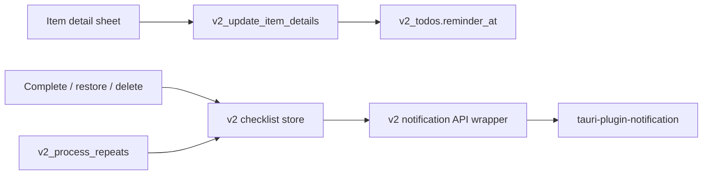

# v2 Reminder Direction

## Decision

v2 reminders are local reminder times, not task execution times, due dates, or calendar events.
An item may have a nullable `reminder_at` in `HH:MM` format. The reminder is active only while the item is incomplete.

## Data Flow

## Boundaries

- `reminder_at` stores only a local time string: `HH:MM`.
- v2 notification ids use a v2-only offset so they do not collide with v1 item notification ids.
- Incomplete items with a reminder schedule one daily notification at `HH:MM` until the item is completed or deleted.
- Completing, deleting, or clearing the reminder cancels the pending v2 notification.
- Repeat reactivation preserves `reminder_at`; when an item becomes incomplete again, the v2 store reschedules its reminder.
- v2 does not import v1 notification stores or helpers. Components and routes do not call notification plugin `invoke()` directly.

## Out Of Scope

Execution time, due date, snooze, notification actions, Supabase sync, widgets, Graph, Streak, Archive, and migration from v1 reminders remain out of this slice.

## Verification

- Rust tests cover migration, `HH:MM` validation, blank reminder clearing, and repeat reactivation preserving reminder data.
- Frontend validation uses `yarn run check`, `yarn build`, and Storybook smoke testing.
- iOS validation requires simulator or device testing because notification delivery depends on native permissions and OS scheduling.
