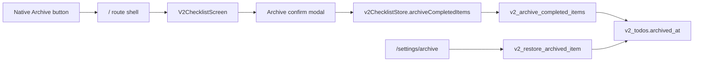

# v2 Archive Direction

## Decision

v2 Archive is a local cleanup action, not a trash can and not a full history screen. It hides completed non-repeating items from the active checklist so the current category stays tidy.

Repeating items are excluded because their completed state is part of the repeat lifecycle. They should remain visible until `v2_process_repeats` reactivates them.

## Data Flow

## Boundaries

- `v2_todos.archived_at` is nullable. Active checklist reads use `archived_at IS NULL`.
- Archive only targets the selected category.
- Archive only targets `done = true`, `repeat_type = 'none'`, and `archived_at IS NULL`.
- Search and active reminder queries ignore archived items.
- Restore clears `archived_at` and keeps `done = true`, so the item returns to the completed section.
- `/settings/archive` is a management surface with restore and explicit permanent delete. History editing stays out of scope.

## UX

- The Liquid Glass Dock `Archive` action opens a confirm modal instead of mutating immediately.
- The confirm copy shows the selected category and the number of eligible completed regular items.
- If there is nothing to archive, the screen shows a small notice instead of running the mutation.
- The native Dock hides while the confirm or notice is open, matching the existing modal blocking policy.
- Restoring or permanently deleting from `/settings/archive` removes the row with a short slide/fade exit so the list does not snap.
- Permanent delete has its own confirm modal and uses `v2_delete_archived_item`, which refuses to delete active non-archived items.

## Verification

- Rust tests cover migration, archive filtering, active list/search exclusion, and restore.
- Frontend validation uses `yarn run check`, `yarn build`, and Storybook smoke testing.
- Manual QA should cover Dock Archive -> confirm -> hidden items -> Settings Archive -> restore -> completed section.
