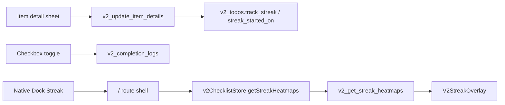

# 016 - v2 Streak Direction

## Decision

v2 streak tracking is opt-in per item. Every item can enable streak tracking from item details, including non-repeating items. Non-repeating items use a daily cadence.

Tracking starts on the logical date when the user turns the toggle on. Existing completion logs remain in SQLite, but streak heatmaps and statistics ignore dates before `streak_started_on`.

## Data Flow

## Boundaries

- v2 streak uses only `v2_todos` and `v2_completion_logs`.
- v1 streak commands, stores, modals, and heatmap components are reference material only.
- The item detail sheet owns the `track_streak` toggle. The Dock only opens the read-only overlay.
- Current and longest streaks are calculated from the item’s current repeat rule. Repeat rule history is not stored.
- `streak_started_on` is a local logical date, based on the existing reset-time setting.
- Archived items are excluded from the Streak overlay.

## UI

`V2StreakOverlay` is a web overlay opened by the native iOS Dock. It hides the Dock while open. The overlay lists one Soft Leaf card per tracked item, with item title, category, repeat cadence, total completions, current streak, longest streak, and a compact 365-day heatmap.

Storybook and browser environments use the same web overlay. iOS uses the existing Swift native item-detail sheet with a native toggle field for editing.

## Out Of Scope

Supabase sync, widgets, Graph, archive recommendations, notification actions, and streak-specific editing screens are out of this slice.

## Verification

- Rust service tests cover migration defaults, enabling/disabling tracking, start-date filtering, and cadence calculation.
- Frontend validation uses `yarn run check`.
- Storybook includes item-detail toggle states and Streak overlay empty/card states.
- iOS validation requires syncing Swift sources and checking the native item-detail toggle plus Dock Streak overlay.
