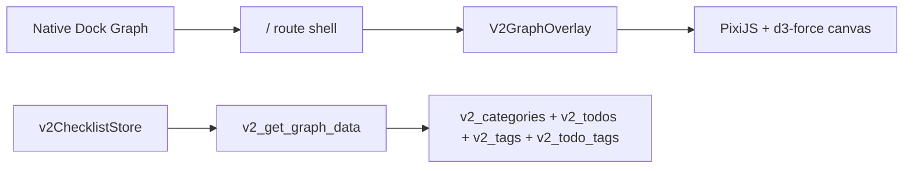

# 017 - v2 Graph Direction

## Decision

v2 graph is a relationship overlay opened from the native Dock. It uses local v2 data only and does not reuse v1 graph commands, stores, or tables.

## Shape

- Categories are membranes, not graph nodes. They show the primary space an item belongs to.
- Items are draggable nodes loosely attracted to category membranes.
- Tags are hub nodes. A `#tag` hub connects to each tagged item, avoiding dense item-to-item lines.
- On narrow iPhone layouts, category membranes stack vertically instead of spreading horizontally.
- Category membranes are visual spaces, not hard boundaries. Tag hubs may float between membranes to show cross-category relationships.
- Archived items are excluded. Completed items are included because they are still visible in the active v2 checklist.
- Empty categories are not shown in the first graph slice.

## Interaction

- Opening the Graph overlay hides the native Dock, matching the Streak overlay pattern.
- Tapping an item node opens an Action Halo instead of immediately changing data.
- The Action Halo offers explicit complete/restore and edit actions near the selected item node.
- Complete/restore uses the existing v2 toggle flow. The selected node color updates immediately, while graph data sync runs quietly in the background.
- Edit uses the same native-first v2 item detail flow used by checklist rows.
- Re-tapping the selected item node, tapping blank canvas, panning, zooming, or dragging closes the Halo.
- Tapping or hovering a tag hub highlights connected items and edges.
- The graph supports pan, wheel zoom, pinch zoom, and node drag.

## Verification

- Rust tests should cover active graph data, archived-item exclusion, and cross-category tag edges.
- Storybook should cover empty, basic, cross-tag, long labels, and error/loading states.
